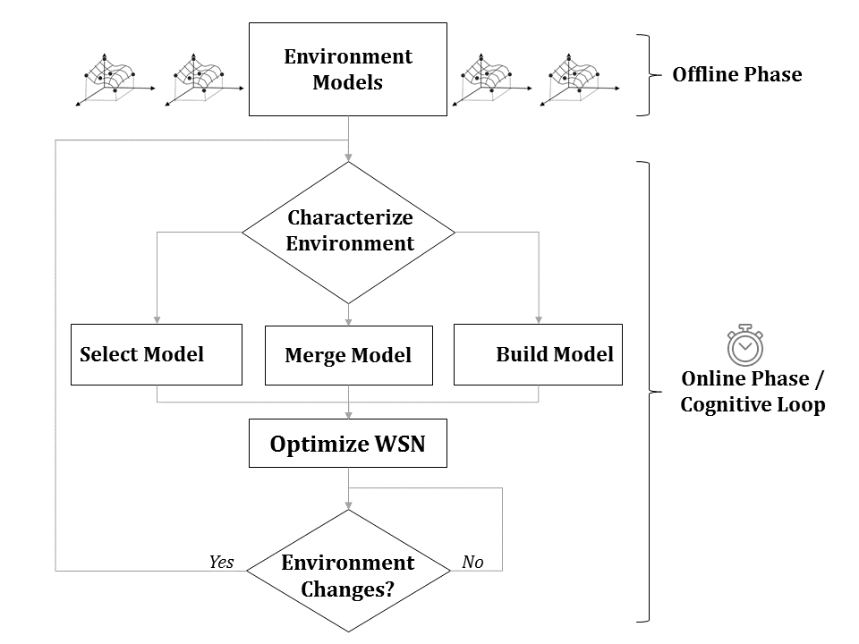

### WSN MAC Optimization in Dynamic Environments using Cloud Repositories

This repository collects all materials that were used in the research work of "WSN MAC Optimization in Dynamic Environments using Cloud Repositories" [1]. The fact that results from most articles cannot be reproduced (due to intellectual property, awareness, among others), leaves a gap for other researchers to validate the results and thus this repository is aimed at filling this very gap.

Leaving the details in the article [1], this research work is aimed at designing an optimally performing Wireless Sensor Network (WSN) Medium Access Control (MAC) protocol, under the influence of a dynamically changing environment. For the general case, a dynamic environment is difficult to handle in WSN because it brings sub-optimal performance and leaves no time for corrective actions to be made. Instead, a slow changing dynamic environment is considered where the environment stays invariant long enough for corrective actions to be made and the system performance to be optimal again.

The optimization process is carried out in two phases and Figure 1 shows the flowchart description.

*Figure 1. Flowchart showing the offline and online operations.

In the first phase (i.e. offline phase), performance models of the system, under different environmental conditions, are constructed and stored in a cloud repository. This allows the cloud repository to have a broader picture of the WSN and the dynamic environment it is operating on. In the second phase (i.e. online phase), the optimization process starts by characterizing the environment. Because of the significant impact on system performance, good characterization is an important step for locating the optimum settings in short period of time. After characterization, the unknown environment can be very well represented by a reference model in the cloud repository. In this case, we select a reference model and tweak the design parameters for optimum system performance. However, for the majority of the cases, characterized environments rarely match a reference model as there are countless states where the dynamic environment can be in. In this case, multiple models from the cloud repository are merged together to represent the unknown environment. Model merging is performed on a subset of reference models which are found to closely match the performance of the unknown environment. Afterward, the representative model is used to optimize the system performance. Besides model selection and model merging, it is also possible that the unknown environment is very far away in performance from the reference models. One situation where this becomes valid is when the dynamic environment is poorly explored during the offline phase. In such cases, a new performance model has to be created all from scratch and that has a huge performance penalty. Finally, the system will enter a waiting state until an environment change is detected, which in this case the whole optimization process is restarted.

So far, we have described briefly the operation of the optimization process and now let us look on the organization of the MATLAB source code.

TODO

[1] Michael Tetemke Mehari, Adnan Shahid, Tom Van Steenkiste, Jan Bauwens, Ivo Couckuyt, Violet R. Syrotiuk, Dirk Deschrijver, Tom Dhaene, Ingrid Moerman, Eli De Poorter. WSN MAC Optimization in Dynamic Environments using Cloud Repositories. Submitted to IEEE/ACM Transactions on ‘Networking‘ 2017.
